# Nombre Proyecto : SistemaChat-WebSocket-Angular7-Spring5

------------------------------------------------------------------------------
## Funcionalidades del proyecto

Las funcionalidades más importantes del proyecto son :
  * Crear un grupo de chat interconectado entre si
  * Avisar a todos los usuarios conectados al chat cuando se conecta un nuevo usuario
  * Avisar a todos los usuarios conectados al chat cuando se desconecta un usuario
  * Avisar al resto del chat cuando un usuario esta escribiendo
  * Notificar los nuevos mensajes a todos los usuarios conectados
  * Asignar un color aleatorio , diferente y unico cada usuario al ingresar al chat

------------------------------------------------------------------------------
### Lenguajes , Frameworks , BD

* El proyecto del lado del Backend esta desarrollado en base a <b>Spring Framework 5</b> con <b>Spring Boot 2</b> ,
  en la cual se crea una aplicación <b>Spring MVC</b> utilizando en el mismo <b>WebSocket</b> con el protocolo <b>Stomp</b>.

* Asi mismo en el FrontEnd esta desarrollado con <b>Angular 7</b> , que es un framework para aplicaciones web desarrollado en TypeScript.

------------------------------------------------------------------------------

### Imagenes del ciclo del chat

* 1) Página de Inicio

    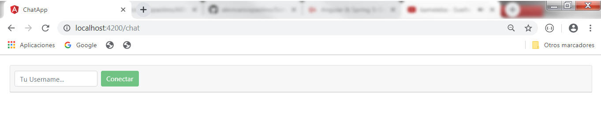

* 2) Ingreso del nombre del primer usuario ("José")

    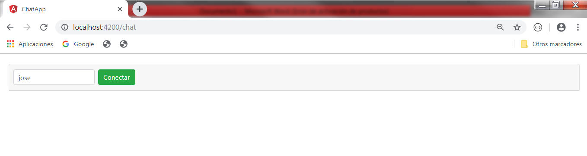

* 3) Página interna del chat actual 

    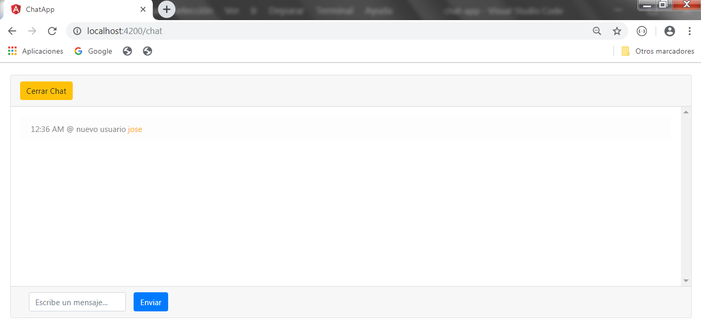

* 4) Ingreso del nombre de un nuevo usuario ("Pedro")

    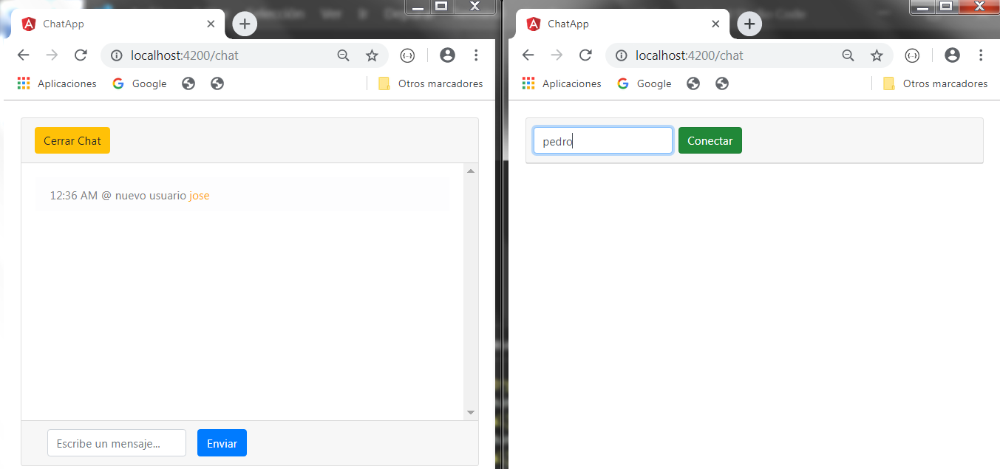

* 5) Página interna del chat actual 

    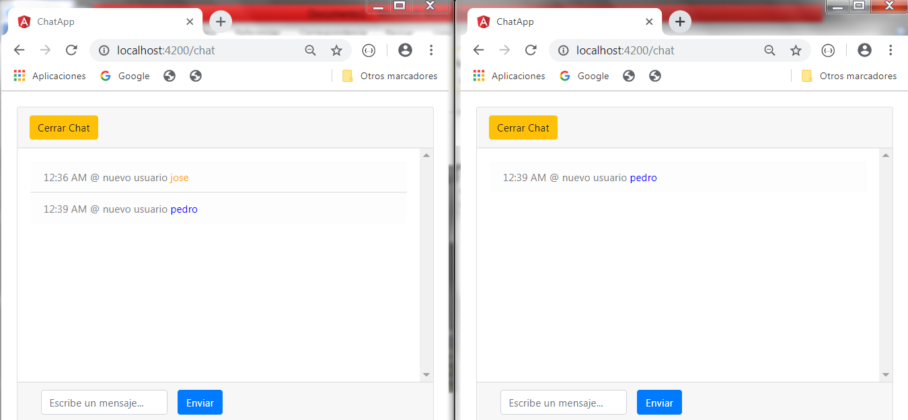

* 6) Usuario ("José") esta escribiendo en el chat

    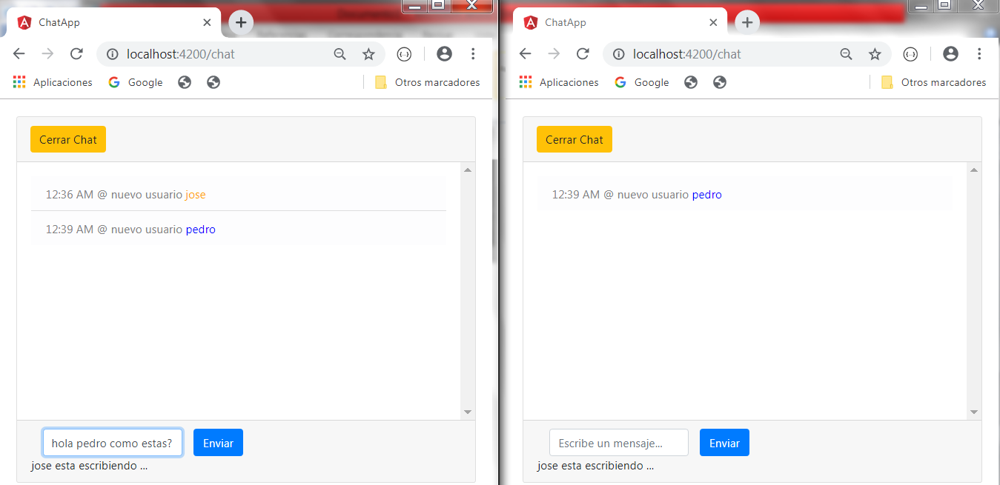

* 7) Nuevo mensaje del usuario ("José") en el chat

    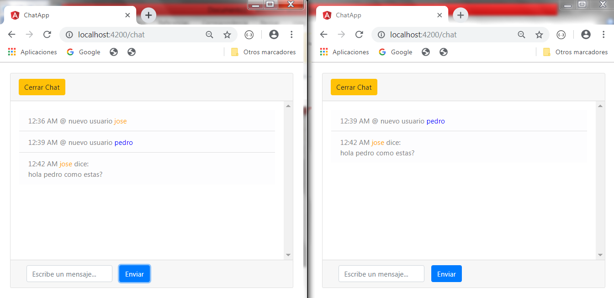

* 8) Usuario ("Pedro") esta escribiendo en el chat

    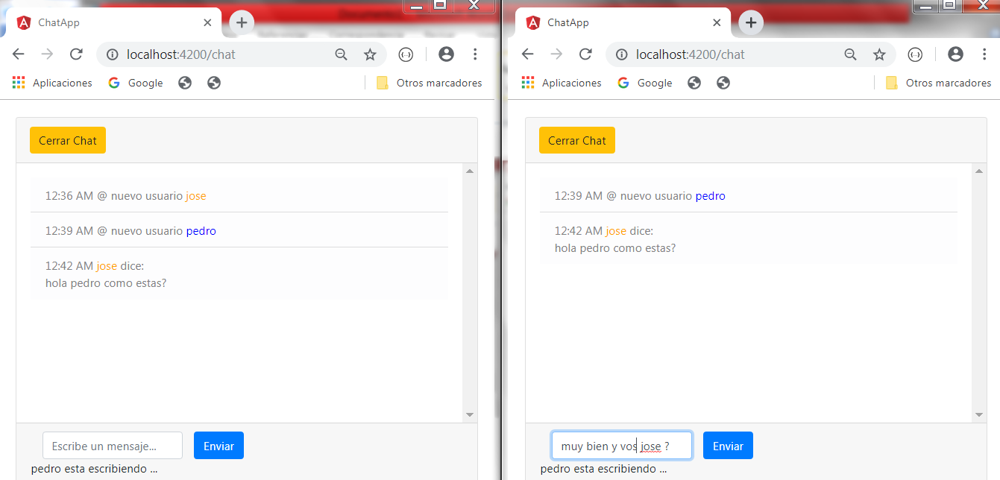

* 9) Nuevo mensaje del usuario ("Pedro") en el chat

    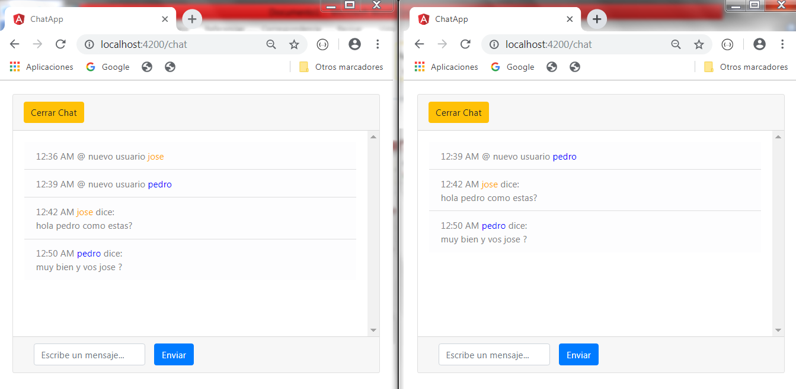

* 10) Ingreso del nombre de un nuevo usuario ("Lucia")

    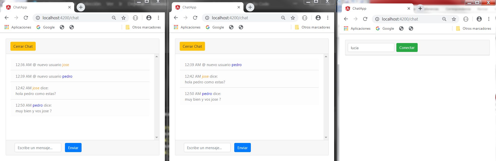

* 11) Página interna del chat actual 

    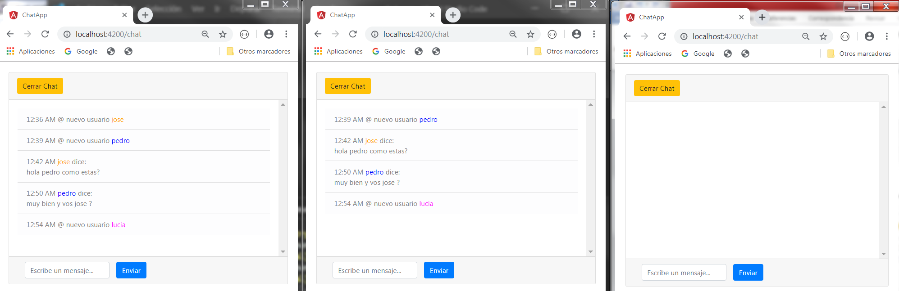

* 12) Usuario ("Lucia") esta escribiendo en el chat 

    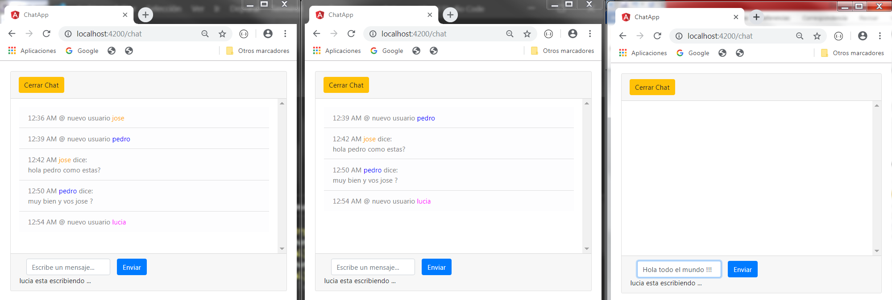

* 13) Nuevo mensaje del usuario ("Lucia") en el chat

    

